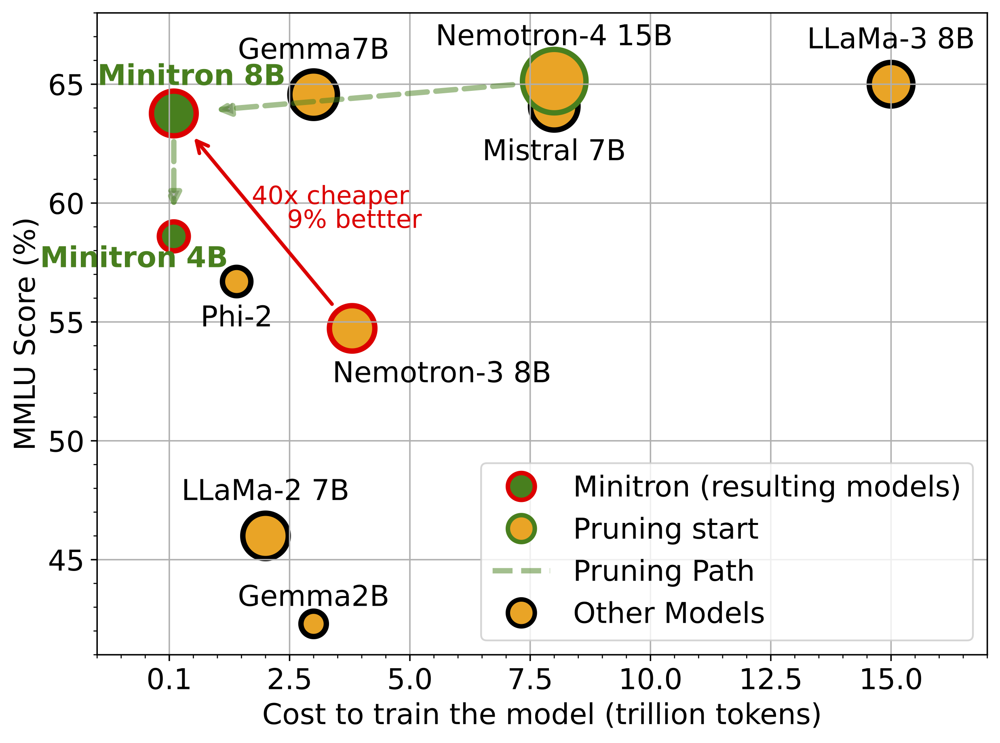

# Minitron

<p align="center">

</p>
<p align="center">
        🤗 <a href="">Hugging Face Models</a>&nbsp&nbsp | &nbsp&nbsp 📄 <a href="">Paper</a> &nbsp&nbsp | &nbsp&nbsp 📜 <a href="">Blog</a> &nbsp | &nbsp 💬 <a href="">Demo</a>
</p>


## Introduction

<p align="center">
  
  <p align="center"><strong>Figure 1: Results for Minitron. Compression results in significant reduction of training costs for additional models(40x) while producing better results.</strong></p>
</p>

Minitron is a family of small language models (SLMs) obtained by pruning NVIDIA's [Nemotron-4 15B]() model. We prune model embedding size, attention heads, and MLP intermediate dimension, following which, we perform continued training with distillation to arrive at the final models.

Deriving the Minitron 8B and 4B models from the base 15B model using our approach requires up to **40x fewer training tokens** per model compared to training from scratch; this results in **compute cost savings of 1.8x** for training the full model family (15B, 8B, and 4B). Minitron models exhibit up to a 16% improvement in MMLU scores compared to training from scratch, perform comparably to other community models such as Mistral 7B, Gemma 7B and Llama-3 8B, and outperform state-of-the-art compression techniques from the literature. Please refer to our [arXiv paper]() for more details.

Minitron models are for research and development only.

## Demonstration of Various Pruning Strategies
<table align="center">
  <tr>
    <th>DEP</th>
    <th>MLP</th>
    <th>ATT</th>
    <th>EMB</th>
    <th>Distillation Loss</th>
    <th>LM Val Loss</th>
  </tr>
  <tr>
    <td>✔️</td>
    <td>✔️</td>
    <td>✔️</td>
    <td>✔️</td>
    <td>5.35 → 0.38</td>
    <td>2.062</td>
  </tr>
  <tr>
    <td>❌</td>
    <td>✔️</td>
    <td>✔️</td>
    <td>✔️</td>
    <td><b>6.33 → 0.37</b></td>
    <td><b>2.049</b></td>
  </tr>
  <tr>
    <td>❌</td>
    <td>✔️</td>
    <td>✔️</td>
    <td>❌</td>
    <td>5.07 → 0.42</td>
    <td>2.101</td>
  </tr>
  <tr>
    <td>✔️</td>
    <td>❌</td>
    <td>❌</td>
    <td>❌</td>
    <td>8.35 → 0.49</td>
    <td>2.155</td>
  </tr>
  <tr>
    <td colspan="4">Train from scratch (random init)</td>
    <td>12.27 → 2.34</td>
    <td>3.953</td>
  </tr>
</table>

<p align="center">
**Table 1: Demonstration of how various pruning strategies perform before and after lightweight retraining using ~1.8B tokens. We prune the Nemotron-4 15B model down to the size of Nemotron-3 8B and report the change in distillation loss (KL divergence on logits) and the final LM validation loss with retraining. We see that width (attention, MLP, embedding) pruning outperforms depth, but only after retraining. The last row shows change in loss for the Nemotron-3 8B model.**
</p>

## Model Card
Please see [MODEL_CARD.md](MODEL_CARD.md).

## Quickstart

### HuggingFace

### TRT-LLM

## License

Minitron is released under the [NVIDIA Open Model License Agreement](https://developer.download.nvidia.com/licenses/nvidia-open-model-license-agreement-june-2024.pdf).

## Citation

If you find our work helpful, please consider citing our paper:
```
@article{minitron2024,
      title={Compact Language Models via Pruning and Knowledge Distillation}, 
      author={Saurav Muralidharan and Sharath Turuvekere Sreenivas and Raviraj Joshi and Marcin Chochowski and Mostofa Patwary and Mohammad Shoeybi and Bryan Catanzaro and Jan Kautz and Pavlo Molchanov},
      journal={arXiv preprint arXiv:XXX},
      year={2024}
}
```
